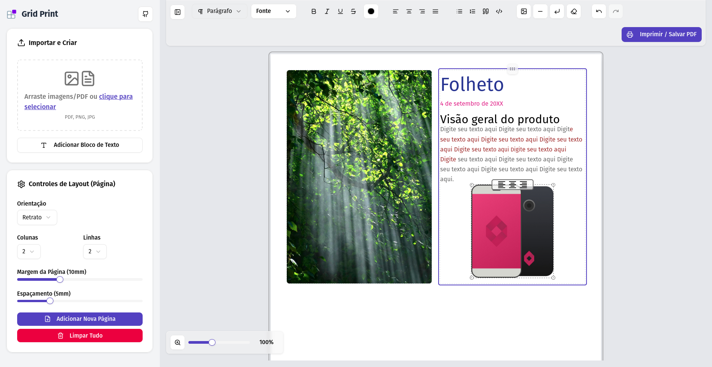

<div align="center">
  
  <h1>Grid Print</h1>
  <p>Crie, organize e imprima layouts personalizados em grade com facilidade.</p>
</div>

<div align="center">
  
</div>

## ✨ Sobre o Projeto

O **Grid Print** é uma aplicação web interativa projetada para simplificar a criação de documentos com layouts em grade. Seja para imprimir múltiplas imagens em uma única folha A4, organizar notas visuais ou criar cartões de estudo, esta ferramenta oferece um controle aprimorado sobre o resultado final.

Com uma interface intuitiva, um editor de texto integrado e controles de layout detalhados, o Grid Print transforma a tarefa de diagramação em uma experiência rápida e agradável. O projeto é totalmente responsivo, funcionando perfeitamente em desktops, tablets e dispositivos móveis.

---

## 🚀 Funcionalidades Principais

- **📄 Layout de Página Flexível:**

  - Altere a orientação da página (Retrato/Paisagem).
  - Defina o número de linhas e colunas na grade.
  - Ajuste as margens da página e o espaçamento entre as células.
  - Adicione múltiplas páginas para criar documentos mais longos.

- **📥 Importação Versátil:**

  - Arraste e solte ou selecione arquivos **PDF** e de **imagem** (JPG, PNG).
  - Páginas de PDFs são automaticamente convertidas em imagens individuais de alta qualidade (300 DPI).

- **✍️ Editor de Texto Integrado:**

  - Adicione blocos de texto diretamente na grade.
  - Ferramentas de formatação completas: negrito, itálico, sublinhado, alinhamento, listas, etc.
  - Controle de estilo de texto (Parágrafo, Títulos H1-H6).
  - Seleção de tamanho da fonte e cor a partir de uma paleta pré-definida.

- **🖼️ Manipulação de Itens:**

  - **Arraste e solte** para reorganizar imagens e blocos de texto dentro da grade.
  - Selecione imagens para acessar controles de edição finos: **escala (zoom), alinhamento vertical e posicionamento (X/Y)**.
  - Adicione arredondamento de bordas para um visual mais suave.

- 🖨️ **Impressão e Exportação:**

  - Gere um **PDF pronto para impressão** com todas as suas páginas e layouts configurados.
  - A visualização em tempo real ("live preview") mostra exatamente como o documento final ficará.

- **📱 Design Responsivo:**
  - Interface otimizada para desktops, tablets e celulares.
  - Painel lateral recolhível para maximizar a área de visualização.
  - Zoom adaptativo que ajusta a página à tela.

---

## 🛠️ Tecnologias Utilizadas

Este projeto foi construído com um ecossistema moderno de JavaScript, focando em performance, manutenibilidade experiência de desenvolvimento.

- **Frontend:** [React](https://reactjs.org/) & [Vite](https://vitejs.dev/)
- **Componentes de UI:** [shadcn/ui](https://ui.shadcn.com/) & [Tailwind CSS](https://tailwindcss.com/)
- **Editor de Texto:** [Tiptap](https://tiptap.dev/)
- **Drag and Drop:** [dnd-kit](https://dndkit.com/)
- **Manipulação de PDF:** [PDF.js](https://mozilla.github.io/pdf.js/)
- **Ícones:** [Lucide React](https://lucide.dev/)

---

## ⚙️ Como Executar o Projeto Localmente

Para rodar o Grid Print em sua máquina, siga os passos abaixo.

### Pré-requisitos

- [Node.js](https://nodejs.org/) (versão 18 ou superior recomendada)
- [pnpm](https://pnpm.io/) (ou npm/yarn, mas pnpm é recomendado para este projeto)

### Instalação

3.  **Instale as dependências:**
    ```bash
    pnpm install
    ```

### Execução

1.  **Inicie o servidor de desenvolvimento:**

    ```bash
    pnpm dev
    ```

2.  **Abra o navegador:**
    A aplicação estará disponível em [http://localhost:5173](http://localhost:5173) (ou outra porta, caso a 5173 esteja em uso).

---

## 📄 Licença

Este projeto é distribuído sob a licença MIT.

---

<div align="center">
  Feito com ❤️ por Jeferson Leite
</div>
